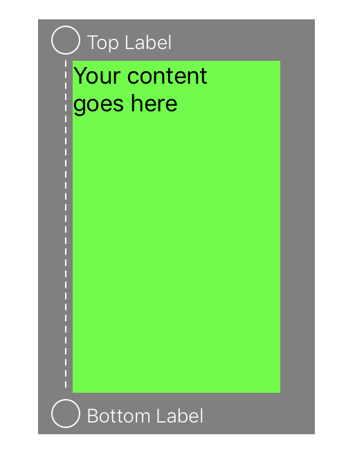
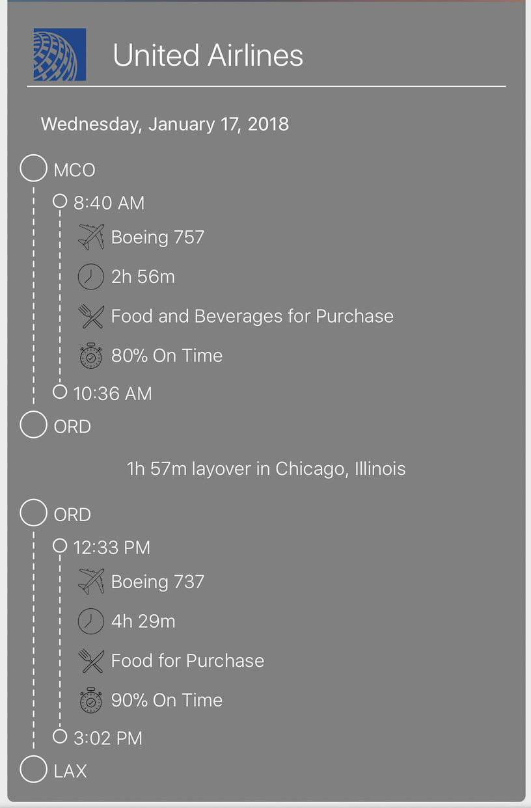

# TimelineView

TimelineView is a Swift UIView subclass that allows you to display arbitrary data between two points or times and provides a built in content view to hold your additional subviews. The points dynamically resize as the bounds change which makes animations like collapsing easy to implement.

    
    

## Installation
Download the TimelineView repo and copy TimelineView.swift into your project.

## Usage

The repo contains a playground file with example code on getting started.

### Code
Create an instance of the timeline view and add it as a subview to a UIViewController or another UIView. You can use frames or auto layout to position it and the timeline will dynamically adjust its size to fit within its bounds.

### Storyboard
Drag a UIView into your project as normal and change the custom class to TimelineView in the identity inspector.

Change the top and bottom labels using the topLabelText and bottomLabelText properties respectively.
